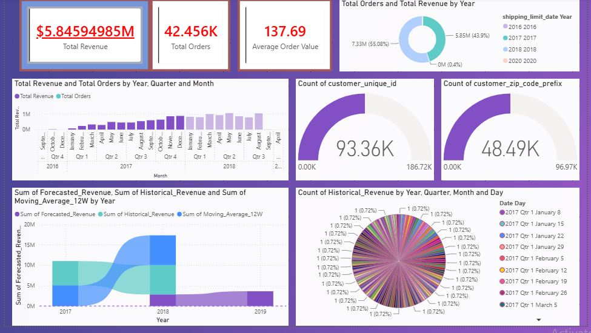

# 🛒 E-Commerce Customer Intelligence Platform

## 📌 Project Overview
This is an end-to-end data analytics and machine learning pipeline built using the Brazilian E-Commerce dataset (Olist). The goal of this project is to provide actionable intelligence to executives regarding customer segmentation, operational churn risks, and future revenue forecasting.

## 🏗️ Architecture & Technologies Used
 Data Engineering:** Python (Pandas, NumPy)
 Data Warehouse:** SQLite (Relational Star Schema)
 Machine Learning:** Scikit-Learn (K-Means Clustering, Random Forest)
 Time-Series Forecasting:** Meta Prophet
 Business Intelligence:** Power BI & DAX

## 🚀 Key Business Insights
1. Customer Segmentation (K-Means):** Identified that the top 2% of "High-Value VIPs" drive an average ticket size of R$ 1,142.00, while the majority of the base are one-time buyers.
2. Churn Risk Prediction (Random Forest):** Built a predictive model with 87% accuracy proving that **delivery delays** account for 56% of all customer dissatisfaction and churn risk.
3. Revenue Forecasting:** Engineered a 12-month forward-looking revenue run-rate to assist in warehouse inventory planning.

## 📊 Executive Dashboard

### Page 1: Executive Overview

### Page 2: Customer Segmentation

### Page 3: Churn Risk Analysis

### Page 4: Revenue Forecasting
#

## 📂 Repository Structure
 `/data`: Contains the cleaned and segmented final datasets.
 `/notebooks`: Contains the Jupyter Notebooks with Python and ML code.
 `/dashboard`: Contains the Power BI dashboard exports and architecture.  
